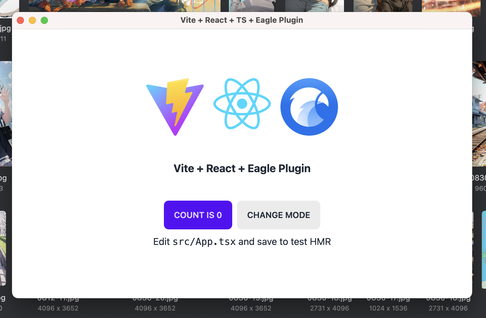

> for gitops workflows, refer to [template](https://github.com/eagle-cooler/template)



# Eagle Zipper Extension

A comprehensive archive viewer extension for Eagle.cool that provides seamless browsing and management of compressed files without extraction.

## Features

✅ **Multi-Format Support**: ZIP, RAR, and 7Z archives  
✅ **Password Protection**: Secure handling of encrypted archives  
✅ **Folder Navigation**: Hierarchical browsing with breadcrumb trails  
✅ **Sortable Columns**: Click headers to sort by name, size, compressed size, or date  
✅ **Eagle Integration**: Native theme sync and file system compatibility  
✅ **Organized Architecture**: Modular codebase with format-specific implementations  

## Tech Stack

- **React 18** + **TypeScript** - Modern UI with type safety
- **Vite** - Fast build system with HMR
- **TailwindCSS** + **DaisyUI** - Responsive styling with Eagle theme integration
- **Archive Libraries**: adm-zip, node-unrar-js, 7zip-min

## Development

**Install dependencies**

```sh
pnpm i
# or
npm i
```

**Development with watch mode**

```sh
pnpm dev
# or
npm run dev
```

**Build for production**

```sh
pnpm build
# or
npm run build
```

## Architecture

```
src/viewer/
├── components/          # React UI components
├── loaders/            # Format-specific archive parsing
├── extractors/         # Format-specific file extraction
├── utils/              # Utility functions
└── types/              # TypeScript definitions
```

## Eagle Extension

This extension integrates with Eagle.cool to provide:
- Automatic archive detection and viewing
- Native theme synchronization (dark/light mode)
- Seamless file system integration
- Password prompt handling for encrypted archives

## Credits

Built on the [eagle-plugin-vite-react-ts](https://github.com/meetqy/eagle-plugin-vite-react-ts) template.
